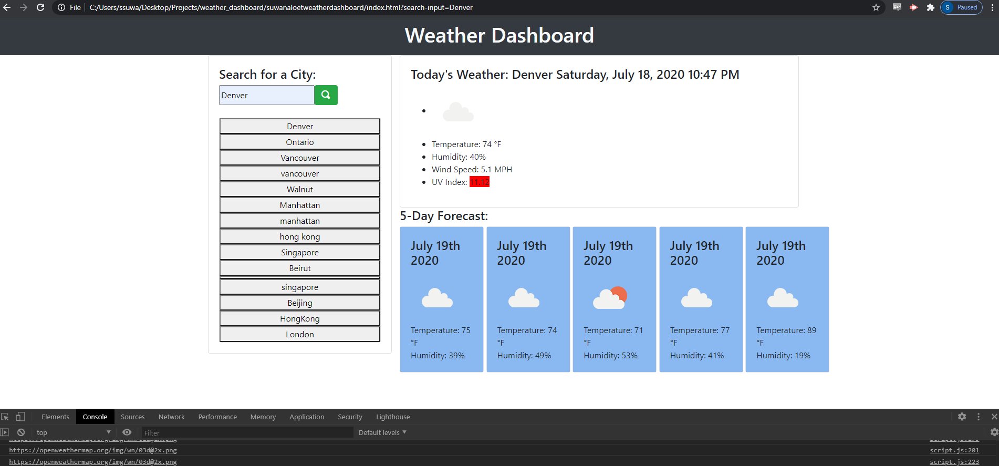

# Weather Dashboard- Sean Suwanaloet

* Weather Dashboard api practice application.

# Features- 
* City search with results for current and 5 day temperature
* Moment JS for time formatting
* Localstorage functionality for search history
* Dynamic color coding for UV Index breakpoints

* Github: https://github.com/suwanaloet/suwanaloetweatherdashboard
* Github Deploy: https://suwanaloet.github.io/suwanaloetweatherdashboard/
* 